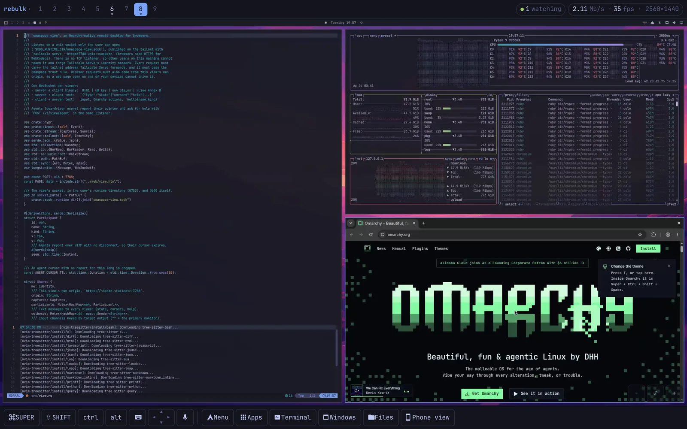
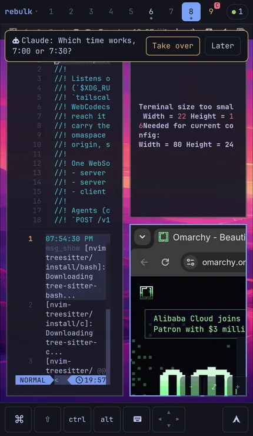
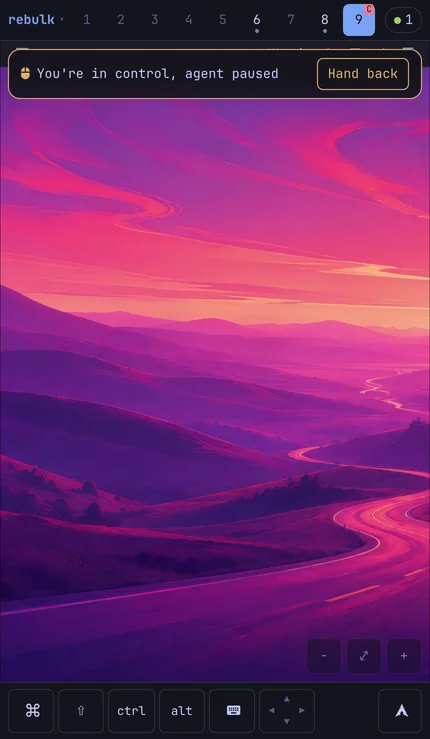

# omaspace

Move [Omarchy](https://omarchy.org) workspaces between your own machines over
[Tailscale](https://tailscale.com), watch and drive a desktop from your phone,
and give AI agents a workspace of their own next to yours.

- **Give and take back workspaces.** Send the workspace you're on to your
  laptop: its browser windows (tabs, and optionally sign-ins), terminals (same
  directory, same tmux session) and editors reopen there, on the same
  workspace. Pull it back later. `--with-files` brings the project folders
  along.
- **Live view.** Watch any of your machines from a phone or another computer's
  browser, with real keyboard, mouse and touch input, a phone-shaped virtual
  screen, workspace switching, file upload and download, and hold-to-talk
  dictation.
- **Agent spaces.** An MCP server gives agents their own Omarchy workspace,
  with a browser signed in as you, a terminal and desktop apps, that never
  takes your focus or pointer. You can watch them from your phone, and hand
  a browser over or take it back. When an agent asks for help (a 2FA code, a
  decision), your phone shows it: **Take over** pauses every agent on that
  machine while you do it, and **Hand back** lets them carry on. Closing the
  view hands back too, so an agent is never left paused by a phone you put
  away.
- **Files.** Copy files and folders between machines, or keep a folder in sync
  both ways.



<p align="center">
  
  &nbsp;&nbsp;
  
</p>

It works only between your own devices: every request is identified with
Tailscale and refused unless it comes from your own account. Nothing goes
through a third-party server. See [SECURITY.md](SECURITY.md).

Linux only; built for Omarchy on Hyprland. A plain Linux server can join as
a *hub* that keeps snapshots for later.

## Install

You need Omarchy, Tailscale and a Rust toolchain.

```sh
git clone https://github.com/cole-robertson/omaspace
cd omaspace
cargo build --release
install -m755 target/release/omaspace ~/.local/bin/
omaspace setup
```

`omaspace setup` installs and starts the user services, publishes the live
view on your tailnet, and adds the Omarchy keybindings, menu and Spaces panel.
Publishing a unix socket with `tailscale serve` needs root or a Tailscale
operator (`sudo tailscale set --operator=$USER`).

Do the same on each machine. They find each other on your tailnet.

Agents using desktop apps (beyond their browser and terminal) also need the
`omaspace-driver` package, which builds cua-driver with Omarchy patches:
`cd pkg/omaspace-driver && makepkg -si`.

## Use

```sh
omaspace peers                        # your machines running omaspace
omaspace send laptop                  # give this workspace to "laptop"
omaspace send laptop --with-files     # ...with its project folders
omaspace pull desk --workspace 3      # take workspace 3 back from "desk"
omaspace put laptop report.pdf        # into laptop's ~/Downloads
omaspace sync laptop ~/notes          # keep a folder the same on both
```

From Omarchy: `SUPER+CTRL+SHIFT+O` opens the Spaces panel (give, take back,
watch your machines), and so does dragging a window to the top edge with
`SUPER` held. `SUPER+CTRL+ALT+O` gives the current workspace to another
machine.

The live view is at `https://<machine>.<your-tailnet>.ts.net:7788` from any of
your devices; add it to your phone's home screen.

For agents, add the MCP server to your agent's config:

```json
{ "mcpServers": { "omaspace": { "command": "omaspace", "args": ["mcp"] } } }
```

Run `omaspace` with no arguments for every command.

## Sign-ins

A browser window's tabs, bookmarks, preferences and site data travel with it.
Cookies, saved passwords and history are withheld unless you allow them, per
transfer (`--allow-sensitive cookies`, or the Omarchy menu asks) or ahead of
time in `~/.config/omaspace/policy.json`. Cookies are decrypted on the sender
and re-encrypted with the receiver's own key; they're never copied as raw
files.

## Development

```sh
cargo test                            # unit and integration tests
cargo clippy --all-targets -- -D warnings
```

[SPEC.md](SPEC.md) describes the design, the snapshot format and the APIs.

The end-to-end suite in [e2e/](e2e/README.md) drives real Omarchy desktops
(windows, input, the live view, agents and transfers), so it runs on demand
against machines you name rather than in CI:

```sh
OMASPACE_E2E_DESK=mydesk OMASPACE_E2E_PEER=mylaptop bin/omaspace-e2e
```

## License

MIT. `pkg/omaspace-driver` builds [cua-driver](https://github.com/trycua/cua)
(MIT) with two patches.
